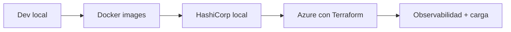
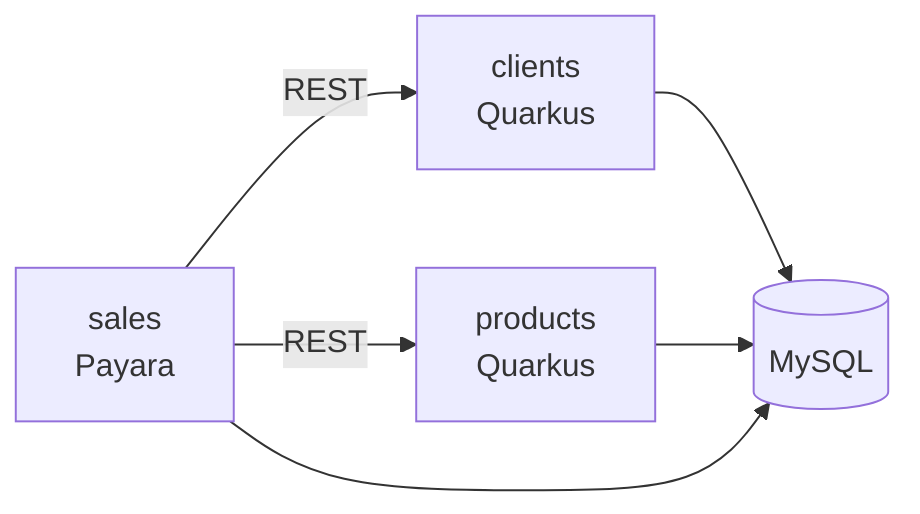
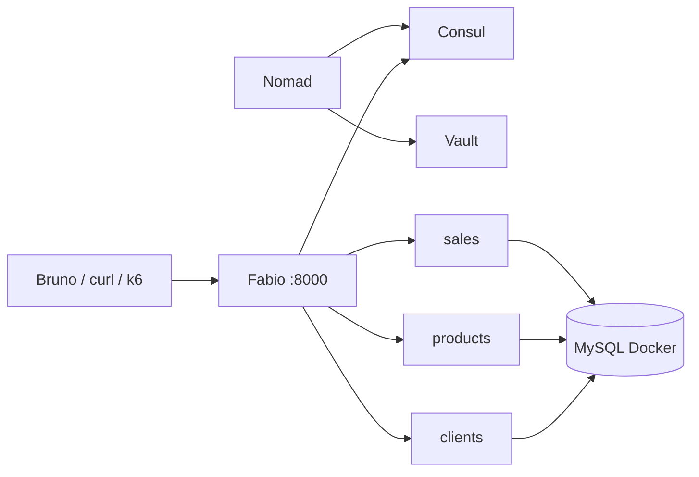
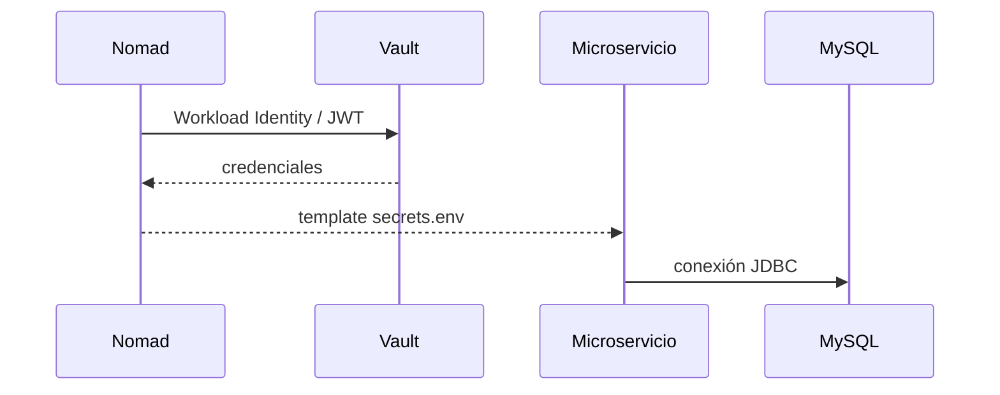
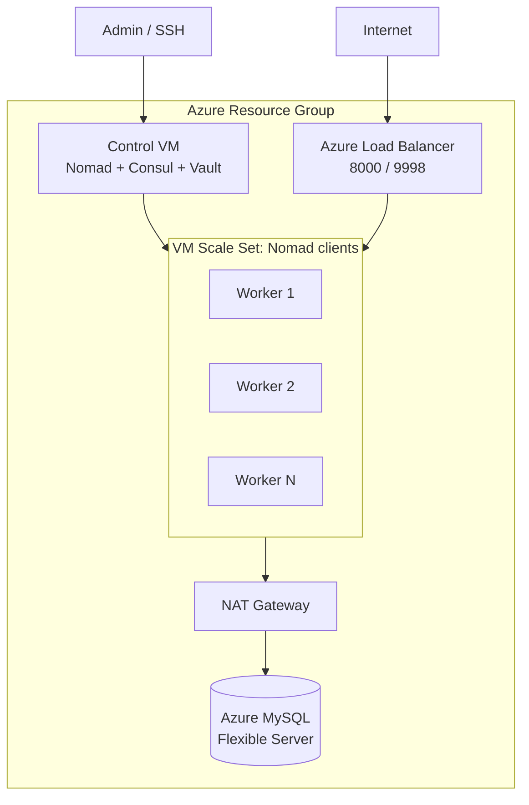

# Jakarta EE y Quarkus en Azure con HashiCorp Nomad

Este repositorio contiene una demo de arquitectura para ejecutar microservicios Java desde el entorno local hasta Azure usando Docker, HashiCorp Nomad, Consul, Vault, Fabio, MySQL y Terraform.

Este material acompaña una charla para **JConf Dominicana, 16 de julio de 2026**, y queda publicado para que otras personas puedan descargar el proyecto, revisar la arquitectura y replicar la demo por partes.

La idea central no es demostrar que Kubernetes o AKS no sirven. La pregunta es otra: **¿todos los proyectos pequeños o medianos necesitan empezar con AKS desde el día uno?**

Para ciertos equipos, la plataforma también debe ser fácil de operar, explicar, repetir y pagar. Esta demo muestra una alternativa más pequeña y entendible para workloads Docker simples, manteniendo capacidades importantes:

- Microservicios Java desplegables.
- Service discovery.
- Secrets fuera del código.
- Gateway dinámico.
- Health checks.
- Escalado horizontal.
- Infraestructura reproducible.
- Pruebas de carga en vivo.

## Qué demuestra

El proyecto recorre una evolución incremental:



La misma aplicación pasa por cuatro ambientes:

| Ambiente        | Objetivo                                                                        |
|-----------------|---------------------------------------------------------------------------------|
| Localhost       | Mostrar que son aplicaciones Java normales, sin dependencia del orquestador.    |
| Docker          | Convertir cada servicio en un workload portable.                                |
| HashiCorp local | Ejecutar Nomad, Consul, Vault, Fabio y MySQL en un entorno de demo local.       |
| Azure           | Crear infraestructura reproducible con Terraform y correr los workloads en VMs. |

## Aplicaciones

| Servicio              | Tecnología                | Responsabilidad                                       |
|-----------------------|---------------------------|-------------------------------------------------------|
| `clients-hc-example`  | Quarkus JVM               | API de clientes.                                      |
| `products-hc-example` | Quarkus JVM               | API de productos.                                     |
| `sales-hc-example`    | Jakarta EE / Payara Micro | API de ventas; consume clientes y productos por REST. |



## Plataforma

| Componente | Rol                                             |
|------------|-------------------------------------------------|
| Nomad      | Scheduler de workloads Docker.                  |
| Consul     | Service discovery y health checks.              |
| Vault      | Entrega de secretos en tiempo de ejecución.     |
| Fabio      | API Gateway dinámico basado en tags de Consul.  |
| MySQL      | Base de datos de la demo.                       |
| Terraform  | Infraestructura cloud reproducible en Azure.    |
| Bruno      | Colección HTTP para probar la API por ambiente. |
| k6         | Carga y validación en vivo.                     |

## Arquitectura local HashiCorp



Los jobs de Nomad registran servicios en Consul con tags `urlprefix`. Fabio lee esos tags y enruta sin configurar rutas a mano:

| Ruta pública       | Servicio           |
|--------------------|--------------------|
| `/clients/api`     | `clients-backend`  |
| `/products/api`    | `products-backend` |
| `/sales/resources` | `sales-backend`    |

Los puertos internos son dinámicos. La URL pública no cambia cuando se escala.

## Secrets con Vault

Las credenciales no viven en el código ni en la imagen Docker. Nomad usa Workload Identity/JWT para obtener secretos desde Vault y los inyecta al workload en tiempo de ejecución.



## Arquitectura en Azure



Terraform crea la infraestructura base: VM de control, VM Scale Set de workers, Load Balancer, NAT Gateway y Azure Database for MySQL Flexible Server.

## Requisitos

- JDK 21.
- Maven o los wrappers incluidos.
- Docker Desktop.
- WSL/Linux para los scripts HashiCorp locales. La demo fue probada con Docker Desktop en Windows y HashiCorp ejecutándose dentro de WSL.
- Nomad, Consul y Vault para la demo local, instalables con `infra/scripts/install-hashicorp.sh`.
- Terraform y Azure CLI instalados en Windows para el despliegue cloud.
- Bruno para usar la colección HTTP.
- k6 para pruebas de carga.

## Descargar el proyecto

Clona el repositorio y entra a la carpeta raíz:

```bash
git clone https://github.com/apuntesdejava/jakartaee-nomad-arch.git
cd jakartaee-nomad-arch
```

Si solo quieres revisar la presentación:

```bash
cd slides
npm install
npm run dev
```

## Ruta recomendada para replicar la demo

La demo se puede repetir por niveles. No necesitas ejecutar Azure para entender todo el proyecto.

1. Revisa las aplicaciones Java en localhost.
2. Construye las imágenes Docker.
3. Levanta el stack HashiCorp local.
4. Prueba endpoints por Fabio.
5. Escala servicios con Nomad.
6. Ejecuta k6 contra el gateway local o cloud.
7. Opcionalmente, despliega la infraestructura en Azure con Terraform.

La forma más práctica de aprender el proyecto es seguir esos pasos en orden. Cada ambiente agrega una pieza nueva sin cambiar la idea central de las aplicaciones.

## Ejecutar en localhost

Este modo sirve para desarrollar cada módulo de forma aislada.

```bash
cd clients-hc-example
./mvnw quarkus:dev
```

```bash
cd products-hc-example
./mvnw quarkus:dev
```

```bash
cd sales-hc-example
./mvnw package payara-micro:dev
```

## Construir imágenes Docker

Desde la raíz del repositorio:

```bash
mvn clean install -Pprod
```

El perfil `prod` construye/publica las imágenes:

```text
docker.io/apuntesdejava/clients-hc-example-jvm:0.0.1
docker.io/apuntesdejava/products-hc-example-jvm:0.0.1
docker.io/apuntesdejava/sales-hc-example:0.0.1
```

Para publicar en Docker Hub debes estar autenticado previamente.

Si vas a replicar la demo con tus propias imágenes, cambia el namespace/tag en los `pom.xml` y en los jobs de `infra/nomad`.

## Ejecutar HashiCorp local

Primera vez:

```bash
./infra/scripts/install-hashicorp.sh
```

Arranque completo:

```bash
./infra/scripts/start-local.sh
```

Esto levanta:

- MySQL por Docker Compose.
- Vault dev con token `root`.
- Consul dev.
- Nomad dev con integración Vault Workload Identity.
- Jobs Nomad para Fabio, clients, products y sales.

URLs locales:

| Servicio  | URL                     |
|-----------|-------------------------|
| Gateway   | `http://localhost:8000` |
| Nomad UI  | `http://localhost:4646` |
| Consul UI | `http://localhost:8500` |
| Vault UI  | `http://localhost:8200` |
| Fabio UI  | `http://localhost:9998` |

Si ejecutas todo en Linux nativo, o haces las pruebas desde la misma terminal WSL donde corre HashiCorp, normalmente puedes usar `localhost`:

```bash
export HASHICORP_HOST=localhost
```

Si ejecutas HashiCorp en WSL y abres el navegador desde Windows, puede que necesites usar la IP de WSL en vez de `localhost`. Obténla así dentro de WSL:

```bash
hostname -I
```

Toma la primera IP y úsala como host:

```bash
export HASHICORP_HOST=<ip_de_wsl>
```

En PowerShell puedes definirla así:

```powershell
$env:HASHICORP_HOST="<ip_de_wsl>"
```

Pruebas rápidas:

```bash
curl http://$HASHICORP_HOST:8000/products/api/q/health/ready
curl http://$HASHICORP_HOST:8000/clients/api/q/health/ready
curl http://$HASHICORP_HOST:8000/sales/resources/sale
```

Para ver que el gateway descubre servicios dinámicamente, abre Fabio UI y revisa las rutas publicadas desde Consul:

```text
http://<ip_de_wsl_o_localhost>:9998
```

Escalado local:

```bash
nomad job scale products-backend api 3
nomad job scale clients-backend api 3
```

## Desplegar en Azure

Este paso es opcional para quienes descarguen el proyecto. Requiere una suscripción de Azure y genera costos mientras los recursos estén vivos.

En esta demo, **Terraform debe ejecutarse desde Windows, no desde WSL**. El despliegue cloud depende de conexiones de red que, en este entorno, no se resuelven correctamente desde WSL.

La configuración Terraform está en `infra/terraform`.

Desde PowerShell:

```powershell
cd infra/terraform
terraform init
terraform validate
terraform apply
```

Outputs esperados:

```text
control_public_ip
gateway_public_ip
fabio_ui
mysql_host
ssh_control
```

Después de crear infraestructura, carga schema y datos:

```powershell
cd ../..
wsl bash ./infra/scripts/seed-azure-db.sh --reset
```

El script lee outputs de Terraform, entra por SSH a la VM de control y ejecuta un contenedor temporal de MySQL para cargar `infra/mysql/init/init.sql`. Desde Windows se invoca con `wsl bash` porque el script es Bash, pero los comandos de Terraform se mantienen en Windows.

Verificación desde la VM de control:

```powershell
ssh azureuser@<control_public_ip>
nomad node status
nomad job status
consul members
```

Pruebas por gateway:

```bash
curl http://<gateway_public_ip>:8000/products/api/q/health/ready
curl http://<gateway_public_ip>:8000/clients/api/q/health/ready
curl http://<gateway_public_ip>:8000/sales/resources/sale
```

Cuando termines una práctica en Azure, destruye los recursos si no los necesitas:

```powershell
cd infra/terraform
terraform destroy
```

Revisa antes cualquier recurso que quieras conservar, especialmente MySQL.

## Bruno

La colección está en:

```text
requests/bruno/Sales-HC
```

Ambientes disponibles:

```text
LOCAL
LOCAL_HC
DOCKER
AZURE
```

Para actualizar IPs:

```bash
cd requests/bruno
javac UpdateIps.java
java UpdateIps env=AZURE ip=<gateway_public_ip>
```

## Carga con k6

Ejemplo para la demo en vivo:

```bash
BASE_URL=http://<gateway_public_ip>:8000 \
PEAK_VUS=120 \
SALE_RATIO=0.05 \
K6_WEB_DASHBOARD=true \
K6_WEB_DASHBOARD_EXPORT=load-tests/k6/report-azure.html \
k6 run load-tests/k6/live-demo.js
```

Dashboard local de k6:

```text
http://127.0.0.1:5665
```

También puedes observar el estado de la plataforma mientras corre la carga:

```bash
bash ./infra/scripts/watch-azure-live.sh
```

Muestra nodos Nomad, jobs, servicios Consul, checks, probes del gateway y estado de Fabio.

## Escalado manual

```bash
ssh azureuser@<control_public_ip>

nomad job scale products-backend api 3
nomad job scale clients-backend api 3
```

Verificación:

```bash
nomad job status products-backend
consul catalog services
```

Fabio balancea automáticamente porque lee Consul. Más instancias, misma URL pública.

## Demo sugerida

1. Mostrar la motivación: no todo proyecto necesita Kubernetes desde el primer día.
2. Ejecutar o revisar los microservicios en localhost.
3. Construir las imágenes Docker.
4. Levantar el stack HashiCorp local.
5. Mostrar Nomad UI, Consul UI, Vault y Fabio.
6. Desplegar o revisar Terraform en Azure.
7. Cargar datos con `seed-azure-db.sh`.
8. Probar endpoints por gateway.
9. Ejecutar carga con k6.
10. Escalar `products` y `clients`.
11. Mostrar que la URL pública no cambia.

## AKS vs Nomad: lectura honesta

Esta demo no propone reemplazar AKS siempre. Propone evitar pagar complejidad antes de necesitarla.

| Tema          | AKS                                                        | Nomad + Consul + Vault                                    |
|---------------|------------------------------------------------------------|-----------------------------------------------------------|
| Control plane | Gestionado por Azure.                                      | VM propia.                                                |
| Orquestación  | Kubernetes.                                                | Nomad.                                                    |
| Discovery     | Services/CoreDNS.                                          | Consul.                                                   |
| Secrets       | Kubernetes Secrets, Key Vault, CSI, etc.                   | Vault.                                                    |
| Gateway       | Ingress, App Gateway o similar.                            | Fabio + Azure Load Balancer.                              |
| Operación     | Más ecosistema, más superficie.                            | Menos piezas, menor curva.                                |
| Mejor para    | Plataformas grandes o equipos que ya necesitan Kubernetes. | Proyectos pequeños/medianos con workloads Docker simples. |

Para costos:

- Contra AKS Free, AKS suele ganar en costo puro porque el control plane no se cobra.
- Contra AKS Standard, Nomad con una VM de control puede ser competitivo para demos o proyectos pequeños.
- Nomad HA requiere más VMs de control y cambia la comparación.
- MySQL, NAT Gateway, Load Balancer y workers existen en ambos escenarios; la diferencia está en la plataforma de orquestación alrededor.

## Slides

La presentación está en:

```text
slides/slides.md
```

Para ejecutarla:

```bash
cd slides
npm install
npm run dev
```

## Recursos

- Blog: `apuntesdejava.com`
- YouTube: `youtube.com/@apuntesdejava`
- X: `x.com/apuntesdejava`
- GitHub: `github.com/apuntesdejava`
- TikTok: `@apuntesdejava`
- Instagram: `@apuntesdejava`

## Referencias

- Nomad: https://developer.hashicorp.com/nomad
- Consul: https://developer.hashicorp.com/consul
- Vault: https://developer.hashicorp.com/vault
- k6 Web Dashboard: https://grafana.com/docs/k6/latest/results-output/web-dashboard/
- AKS pricing tiers: https://learn.microsoft.com/azure/aks/free-standard-pricing-tiers
- Azure Retail Prices API: https://learn.microsoft.com/rest/api/cost-management/retail-prices
