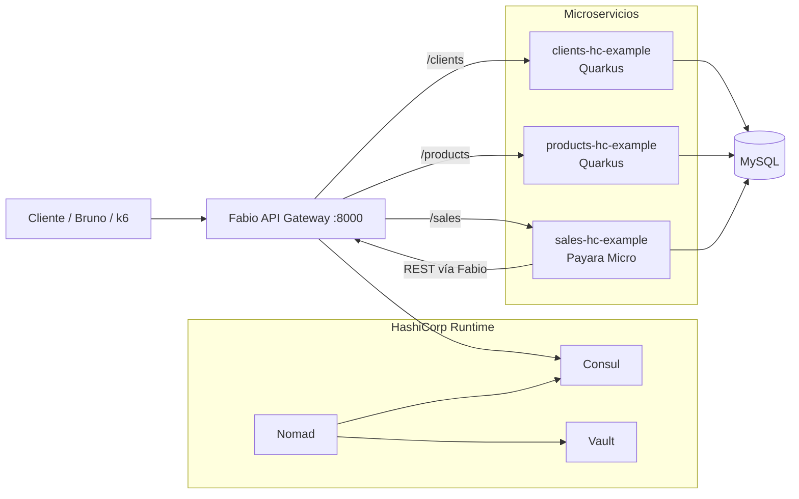
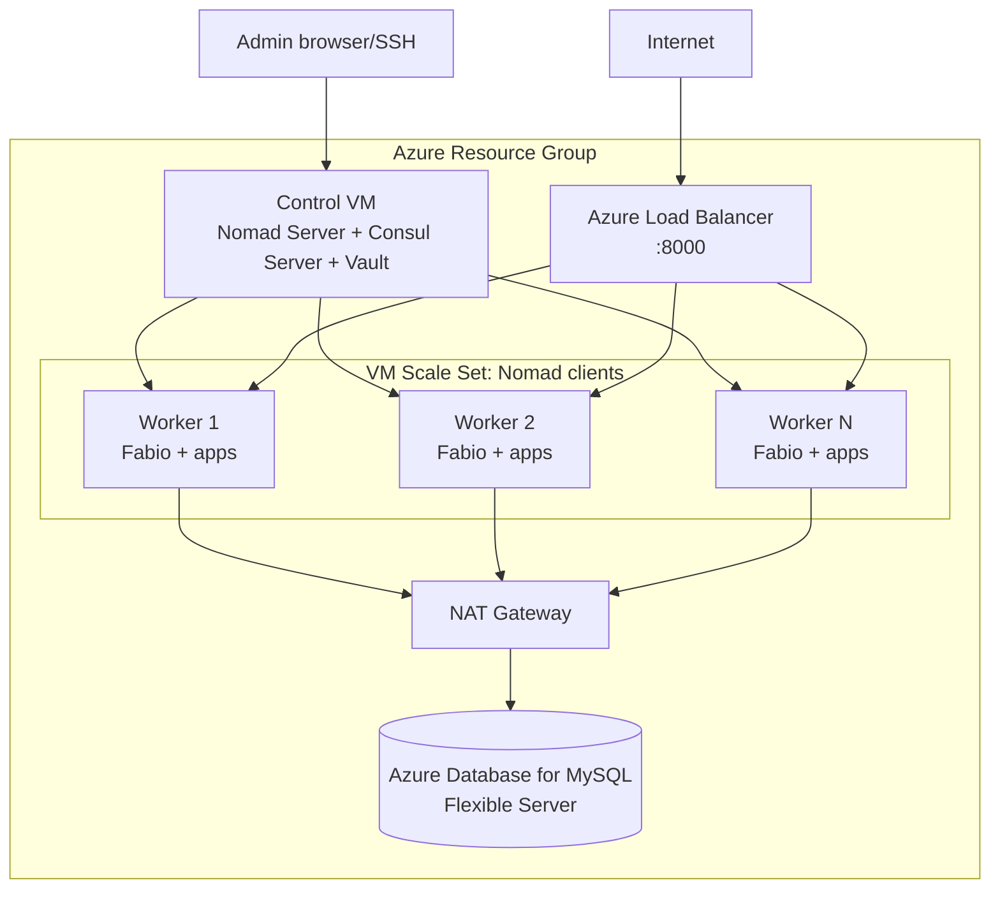

# Jakarta EE, Quarkus y HashiCorp Nomad

Este proyecto demuestra una arquitectura de microservicios Java que puede correr localmente y en Azure usando **Nomad + Consul + Vault + Fabio** como alternativa ligera a AKS para escenarios pequeños y medianos.

La idea de la demo es sencilla: mantener el modelo de microservicios, service discovery, secrets, gateway, health checks y escalado horizontal, pero con una plataforma operacional más pequeña que Kubernetes.

## Componentes

| Componente            | Tecnología                 | Rol                                                    |
|-----------------------|----------------------------|--------------------------------------------------------|
| `clients-hc-example`  | Quarkus JVM                | API de clientes                                        |
| `products-hc-example` | Quarkus JVM                | API de productos                                       |
| `sales-hc-example`    | Jakarta EE / Payara Micro  | API de ventas; consume clients/products por REST       |
| Nomad                 | HashiCorp                  | Scheduler de workloads Docker                          |
| Consul                | HashiCorp                  | Service discovery y health checks                      |
| Vault                 | HashiCorp                  | Secretos para credenciales MySQL vía Workload Identity |
| Fabio                 | Fabio LB                   | API Gateway dinámico basado en tags de Consul          |
| MySQL                 | Docker local / Azure MySQL | Base de datos común                                    |
| Terraform             | Azure                      | Infraestructura cloud                                  |
| Bruno                 | Bruno collection           | Pruebas HTTP por ambiente                              |

## Arquitectura



En local todo corre en WSL con Docker Desktop. En Azure, Terraform crea un nodo de control y un VM Scale Set de workers:



## Enrutamiento

Los jobs Nomad registran servicios en Consul con tags `urlprefix`:

| Servicio | Tag Fabio             | URL local/cloud    |
|----------|-----------------------|--------------------|
| clients  | `urlprefix-/clients`  | `/clients/api`     |
| products | `urlprefix-/products` | `/products/api`    |
| sales    | `urlprefix-/sales`    | `/sales/resources` |

Los puertos de los backends son dinámicos. Fabio descubre el puerto real por Consul, por eso se puede escalar una app sin cambiar URLs públicas.

## Ambiente dev

Útil para desarrollar cada módulo sin levantar todo Nomad.

```bash
cd clients-hc-example
./mvnw quarkus:dev
```

```bash
cd products-hc-example
./mvnw quarkus:dev
```

```bash
cd sales-hc-example
./mvnw package -Pdev
```

En modo dev se usan configuraciones locales, H2 o archivos de setup del módulo. Para probar la arquitectura completa se recomienda `LOCAL_HC`.

## Ambiente Docker / imágenes

Desde la raíz:

```bash
mvn clean install -Pprod
```

Con el perfil `prod`, Maven compila los módulos y ejecuta `docker:build` + `docker:push` para:

```text
docker.io/apuntesdejava/clients-hc-example-jvm:0.0.1
docker.io/apuntesdejava/products-hc-example-jvm:0.0.1
docker.io/apuntesdejava/sales-hc-example:0.0.1
```

Requisito: estar autenticado contra Docker Hub si vas a publicar.

## Ambiente local HashiCorp

Se ejecuta en WSL.

Primera vez:

```bash
./infra/scripts/install-hashicorp.sh
```

Arranque completo:

```bash
./infra/scripts/start-local.sh
```

Esto levanta:

- MySQL por Docker Compose.
- Vault dev con token `root`.
- Consul dev.
- Nomad dev con integración Vault Workload Identity.
- Jobs Nomad para Fabio, clients, products y sales.

URLs locales:

```text
Gateway:   http://localhost:8000
Nomad UI:  http://localhost:4646
Consul UI: http://localhost:8500
Vault UI:  http://localhost:8200
Fabio UI:  http://localhost:9998
```

Pruebas rápidas:

```bash
curl http://localhost:8000/products/api/q/health/ready
curl http://localhost:8000/clients/api/q/health/ready
curl http://localhost:8000/sales/resources/sale
```

## Ambiente Azure

Terraform está en:

```text
infra/terraform
```

Configura:

```hcl
resource_group_name = "jakartaee-nomad-demo-rg"
location            = "westeurope"

vm_size        = "Standard_D2s_v4"
worker_vm_size = "Standard_D2s_v4"
worker_count   = 3

mysql_server_name = "jakartaee-nomad-mysql-v2"
manage_mysql      = true
```

Despliegue:

```bash
cd infra/terraform
terraform init
terraform plan
terraform apply
```

Outputs esperados:

```text
control_public_ip
gateway_public_ip
mysql_host
ssh_control
```

Carga de schema y datos iniciales:

```bash
cd ../..
bash ./infra/scripts/seed-azure-db.sh
```

Este paso ejecuta `infra/mysql/init/init.sql` contra Azure MySQL usando la VM de control como salto SSH. Es intencionalmente explícito para que Terraform cree infraestructura y el sembrado de datos quede como operación de demo.

Si necesitas reiniciar los datos para repetir la presentación:

```bash
bash ./infra/scripts/seed-azure-db.sh --reset
```

Verificación:

```bash
ssh azureuser@<control_public_ip>
nomad node status
nomad job status
consul members
```

Pruebas por gateway:

```bash
curl http://<gateway_public_ip>:8000/products/api/q/health/ready
curl http://<gateway_public_ip>:8000/clients/api/q/health/ready
curl http://<gateway_public_ip>:8000/sales/resources/sale
```

### MySQL ya desplegado

Para demos repetidas conviene mantener MySQL vivo y recrear solo Nomad/VMs. El stack soporta:

```hcl
manage_mysql = false
```

Si MySQL ya está en el state y quieres dejar de gestionarlo sin destruirlo:

```bash
terraform state rm 'azurerm_mysql_flexible_server.mysql[0]'
terraform state rm 'azurerm_mysql_flexible_database.db[0]'
terraform state rm 'azurerm_mysql_flexible_server_firewall_rule.allow_control[0]'
terraform state rm 'azurerm_mysql_flexible_server_firewall_rule.allow_nat[0]'
terraform state rm 'azurerm_mysql_flexible_server_configuration.require_secure_transport[0]'
```

Nota: para que sobreviva a `terraform destroy`, MySQL debería vivir en otro Resource Group o en otro stack Terraform.

Cuando `manage_mysql = false`, recuerda que Terraform reutiliza el servidor/base, pero no garantiza que existan tablas ni datos. Antes de la demo puedes dejarlo listo con:

```bash
bash ./infra/scripts/seed-azure-db.sh
```

## Bruno

La colección está en:

```text
requests/bruno/Sales-HC
```

Ambientes:

```text
LOCAL
LOCAL_HC
DOCKER
AZURE
```

Para actualizar IPs:

```bash
cd requests/bruno
javac UpdateIps.java
java UpdateIps env=AZURE ip=<gateway_public_ip>
```

## Escalado manual

Los backends usan puertos dinámicos, así que se pueden escalar varias réplicas:

```bash
nomad job scale products-backend api 3
nomad job scale clients-backend api 3
```

Ver estado:

```bash
nomad job status products-backend
consul catalog services
```

Fabio balancea automáticamente porque lee Consul.

## Pruebas con k6

Ejemplo simple contra gateway:

```javascript
import http from 'k6/http';

export const options = {
  vus: 100,
  duration: '2m',
};

export default function () {
  http.get('http://localhost:8000/products/api/product');
}
```

Ejecución:

```bash
k6 run products-hc-example/k6-tests/simple.js
```

Para Azure cambia `localhost` por `gateway_public_ip`.

## Comparativa de costos: AKS vs HashiCorp

Esta comparación es orientativa. Los precios cambian por región, fecha, moneda, contrato, reservas y ahorro comprometido; para números finales usa Azure Pricing Calculator o la Azure Retail Prices API.

Fuentes oficiales:

- AKS tiene tiers Free, Standard y Premium. Free no cobra gestión del cluster, pero no incluye SLA financiero; Standard/Premium agregan SLA/soporte y se paga además la infraestructura consumida. Ver documentación de AKS pricing tiers.
- Azure Retail Prices API permite consultar precios públicos por SKU/región.
- Azure Database for MySQL Flexible Server cobra por compute, storage y backup.
- NAT Gateway cobra por hora y por GB procesado.

| Concepto          | AKS                                                       | HashiCorp Nomad en VMs               |
|-------------------|-----------------------------------------------------------|--------------------------------------|
| Control plane     | Free en AKS Free; pago en Standard/Premium                | VM de control propia                 |
| Workers           | VMSS/node pools                                           | VMSS Nomad clients                   |
| Gateway           | Ingress controller / Load Balancer / App Gateway opcional | Fabio + Azure Load Balancer          |
| Secrets           | Kubernetes Secrets, CSI, Key Vault, etc.                  | Vault Workload Identity              |
| Service discovery | Kubernetes Services/CoreDNS                               | Consul + Fabio                       |
| Base de datos     | Azure MySQL igual                                         | Azure MySQL igual                    |
| Operación         | Kubernetes completo                                       | Nomad/Consul/Vault, menor superficie |
| Escalado          | HPA/KEDA/Cluster Autoscaler                               | Nomad scale/manual/autoscaler        |

Lectura honesta para la demo:

- Si comparas contra **AKS Free** con los mismos nodos, AKS puede ser igual o incluso más barato en control plane porque Microsoft no cobra el plano de control Free.
- Si comparas contra un entorno **AKS Standard/production-like**, con SLA de API server, add-ons, ingress, observabilidad y operación Kubernetes, el stack HashiCorp puede ser más barato y simple para equipos pequeños.
- Nomad no elimina el costo de compute; reduce complejidad y puede permitir una topología más pequeña.
- Para proyectos medianos, la ventaja aparece cuando no necesitas todo Kubernetes pero sí quieres scheduler, discovery, secrets, rolling deploys y escalado.

Ejemplo de modelo para estimar:

```text
HashiCorp demo:
  1 control VM
  N worker VMs
  1 Azure Load Balancer
  1 NAT Gateway
  1 Azure MySQL Flexible Server

AKS comparable:
  AKS management tier
  N worker VMs
  Load Balancer / Ingress
  NAT Gateway o salida administrada
  1 Azure MySQL Flexible Server
```

La diferencia no está en MySQL ni en los workers; está en cuánto pagas y operas por la plataforma de orquestación alrededor.

## Referencias

- AKS pricing tiers: https://learn.microsoft.com/en-us/azure/aks/free-standard-pricing-tiers
- Azure Retail Prices API: https://learn.microsoft.com/en-us/rest/api/cost-management/retail-prices/azure-retail-prices
- Azure MySQL Flexible Server pricing: https://azure.microsoft.com/en-us/pricing/details/mysql/
- Azure MySQL service tiers: https://learn.microsoft.com/en-us/azure/mysql/flexible-server/concepts-service-tiers-storage
- Azure NAT Gateway pricing: https://azure.microsoft.com/en-us/pricing/details/azure-nat-gateway/
