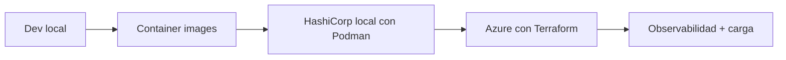
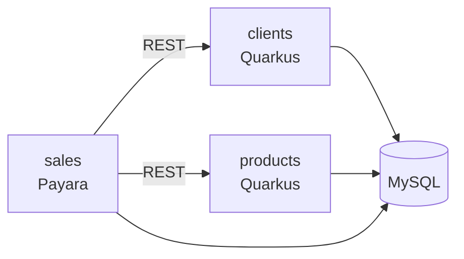
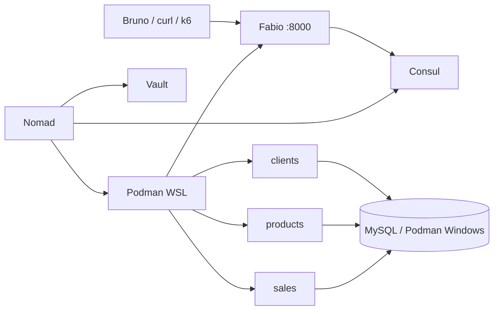
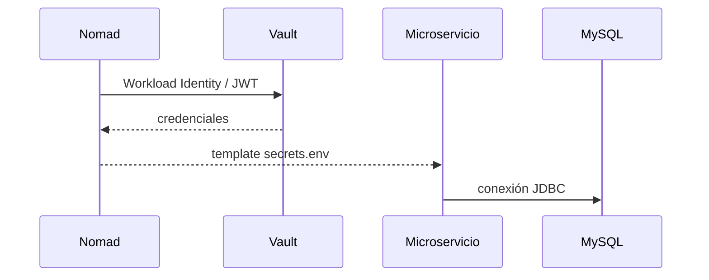
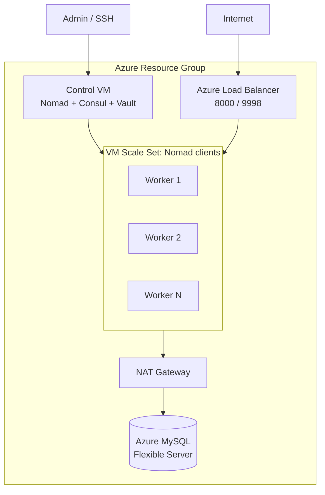

# Jakarta EE y Quarkus en Azure con HashiCorp Nomad

Este repositorio contiene una demo de arquitectura para ejecutar microservicios Java desde el entorno local hasta Azure usando **Podman**, HashiCorp Nomad, Consul, Vault, Fabio, MySQL y Terraform.

Este material acompaña una charla para **JConf Dominicana, 16 de julio de 2026**, y queda publicado para que otras personas puedan descargar el proyecto, revisar la arquitectura y replicar la demo por partes.

La idea central no es demostrar que Kubernetes o AKS no sirven. La pregunta es otra: **¿todos los proyectos pequeños o medianos necesitan empezar con AKS desde el día uno?**

Para ciertos equipos, la plataforma también debe ser fácil de operar, explicar, repetir y pagar. Esta demo muestra una alternativa más pequeña y entendible para workloads de contenedores simples, manteniendo capacidades importantes:

- Microservicios Java desplegables.
- Service discovery.
- Secrets fuera del código.
- Gateway dinámico.
- Health checks.
- Escalado horizontal.
- Infraestructura reproducible.
- Pruebas de carga en vivo.

---

## Qué demuestra

El proyecto recorre una evolución incremental:



La misma aplicación pasa por cuatro ambientes:

| Ambiente        | Objetivo                                                                                |
|-----------------|-----------------------------------------------------------------------------------------|
| Localhost       | Mostrar que son aplicaciones Java normales, sin dependencia del orquestador.            |
| Containers      | Convertir cada servicio en un workload portable usando imágenes de contenedor.          |
| HashiCorp local | Ejecutar Nomad, Consul, Vault, Fabio y MySQL en un entorno de demo local usando Podman. |
| Azure           | Crear infraestructura reproducible con Terraform y correr los workloads en VMs.         |

---

## Aplicaciones

| Servicio              | Tecnología                | Responsabilidad                                       |
|-----------------------|---------------------------|-------------------------------------------------------|
| `clients-hc-example`  | Quarkus JVM               | API de clientes.                                      |
| `products-hc-example` | Quarkus JVM               | API de productos.                                     |
| `sales-hc-example`    | Jakarta EE / Payara Micro | API de ventas; consume clientes y productos por REST. |



---

## Plataforma

| Componente | Rol                                             |
|------------|-------------------------------------------------|
| Nomad      | Scheduler de workloads de contenedores.         |
| Consul     | Service discovery y health checks.              |
| Vault      | Entrega de secretos en tiempo de ejecución.     |
| Fabio      | API Gateway dinámico basado en tags de Consul.  |
| Podman     | Runtime de contenedores para la demo local.     |
| MySQL      | Base de datos de la demo.                       |
| Terraform  | Infraestructura cloud reproducible en Azure.    |
| Bruno      | Colección HTTP para probar la API por ambiente. |
| k6         | Carga y validación en vivo.                     |

---

## Arquitectura local HashiCorp

El entorno local utiliza dos instalaciones independientes de Podman:

- **Podman en Windows**
    - Construye y publica imágenes a través de Maven/Fabric8.
    - Ejecuta MySQL mediante Podman Compose.

- **Podman dentro de WSL2**
    - Es utilizado por Nomad como runtime de workloads.
    - Ejecuta Fabio, clients, products y sales.

Nomad, Consul y Vault también se ejecutan dentro de WSL2.



Los jobs de Nomad registran servicios en Consul con tags `urlprefix`.

Fabio lee esos tags y crea dinámicamente las rutas:

| Ruta pública       | Servicio           |
|--------------------|--------------------|
| `/clients/api`     | `clients-backend`  |
| `/products/api`    | `products-backend` |
| `/sales/resources` | `sales-backend`    |

Los puertos internos de los backends son dinámicos. La URL pública no cambia cuando se escala.

---

## Secrets con Vault

Las credenciales no viven en el código ni en las imágenes.

Nomad usa Workload Identity/JWT para obtener secretos desde Vault y los inyecta al workload en tiempo de ejecución.



---

## Arquitectura en Azure



Terraform crea la infraestructura base:

- VM de control.
- VM Scale Set de workers.
- Load Balancer.
- NAT Gateway.
- Azure Database for MySQL Flexible Server.

---

# Requisitos

Para ejecutar toda la demo local:

- JDK 21.
- Maven o los wrappers incluidos.
- Windows 10/11.
- WSL2.
- Podman en Windows.
- Podman dentro de WSL2.
- Nomad.
- Consul.
- Vault.
- Bruno para usar la colección HTTP.
- k6 para las pruebas de carga.

Para Azure:

- Terraform.
- Azure CLI.
- Una suscripción de Azure.

> [!IMPORTANT]
> El entorno local usa **dos instalaciones independientes de Podman**:
>
> - Podman en Windows para construir/publicar imágenes y ejecutar MySQL.
> - Podman dentro de WSL2 como runtime utilizado por Nomad.
>
> La instalación completa, incluyendo WSL2, Podman, el socket rootless, el driver Podman de Nomad y troubleshooting, está documentada en:
>
> **[Local Environment Setup](docs/local-environment.md)**

---

## Descargar el proyecto

Clona el repositorio:

```bash
git clone https://github.com/apuntesdejava/jakartaee-nomad-arch.git
cd jakartaee-nomad-arch
```

Si quieres trabajar con la rama de desarrollo:

```bash
git switch devel
```

Si solo quieres revisar la presentación:

```bash
cd slides
npm install
npm run dev
```

---

# Ruta recomendada para replicar la demo

La demo se puede repetir por niveles.

No necesitas desplegar Azure para entender el proyecto.

1. Ejecuta las aplicaciones Java directamente.
2. Construye las imágenes de contenedor.
3. Publica las imágenes en Docker Hub.
4. Levanta el entorno HashiCorp local.
5. Ejecuta los workloads con Nomad y Podman.
6. Prueba los endpoints a través de Fabio.
7. Escala servicios con Nomad.
8. Ejecuta k6 contra el gateway local o cloud.
9. Opcionalmente, despliega la infraestructura en Azure con Terraform.

Para preparar el entorno local desde cero:

**[Local Environment Setup](docs/local-environment.md)**

---

# Ejecutar en localhost

Este modo sirve para desarrollar cada módulo de forma aislada.

## Clients

```bash
cd clients-hc-example
./mvnw quarkus:dev
```

## Products

```bash
cd products-hc-example
./mvnw quarkus:dev
```

## Sales

```bash
cd sales-hc-example
./mvnw package payara-micro:dev
```

---

# Construir imágenes de contenedor

Desde la raíz del repositorio:

```bash
mvn clean install -Pprod
```

El proyecto utiliza el plugin Maven de Fabric8:

```text
io.fabric8:docker-maven-plugin
```

A pesar del nombre del plugin, el runtime utilizado por esta demo es **Podman**.

En Windows, Fabric8 se comunica con Podman utilizando la API compatible con Docker que expone Podman Machine.

Las imágenes generadas actualmente son:

```text
docker.io/apuntesdejava/clients-hc-example-jvm:0.0.1
docker.io/apuntesdejava/products-hc-example-jvm:0.0.1
docker.io/apuntesdejava/sales-hc-example:0.0.1
```

> `docker.io` identifica Docker Hub como registry. No significa que Docker sea utilizado como runtime.

Para publicar las imágenes debes tener configuradas las credenciales del registry.

La configuración completa está documentada en:

**[Local Environment Setup](docs/local-environment.md)**

Si vas a replicar la demo con tus propias imágenes, cambia el namespace/tag correspondiente en los `pom.xml` y en los jobs de:

```text
infra/nomad
```

---

# Ejecutar HashiCorp local

El entorno local ejecuta:

- Vault.
- Consul.
- Nomad.
- Fabio.
- Clients.
- Products.
- Sales.

Nomad utiliza **Podman dentro de WSL2** para ejecutar los contenedores.

MySQL se ejecuta usando **Podman en Windows**.

## Primera instalación

Consulta:

**[Local Environment Setup](docs/local-environment.md)**

También puedes instalar las herramientas HashiCorp mediante:

```bash
./infra/scripts/install-hashicorp.sh
```

---

## Arranque normal

Primero, desde PowerShell:

```powershell
podman machine start
```

Desde la raíz del proyecto:

```powershell
podman compose -f .\infra\compose.yaml up -d
```

Verifica MySQL:

```powershell
podman ps
```

Después, desde WSL:

```bash
./infra/scripts/start-local.sh
```

El script levanta y configura:

- Vault en modo dev.
- Consul.
- Nomad.
- Integración Vault Workload Identity.
- Configuración Consul KV.
- Jobs Nomad para Fabio, clients, products y sales.

---

## Verificar los jobs

```bash
nomad status
```

El resultado esperado es similar a:

```text
ID                Type     Priority  Status
api-gateway       system   50        running
clients-backend   service  50        running
products-backend  service  50        running
sales-backend     service  50        running
```

---

## Verificar Consul

```bash
consul catalog services
```

El entorno completo debería registrar:

```text
clients-backend
consul
fabio
nomad
nomad-client
products-backend
sales-backend
```

---

# URLs locales

Desde la misma instancia WSL:

| Servicio  | URL                     |
|-----------|-------------------------|
| Gateway   | `http://localhost:8000` |
| Nomad UI  | `http://localhost:4646` |
| Consul UI | `http://localhost:8500` |
| Vault UI  | `http://localhost:8200` |
| Fabio UI  | `http://localhost:9998` |

Si accedes desde Windows y `localhost` no funciona debido a la configuración de red de WSL, obtén la IP:

```bash
hostname -I | awk '{print $1}'
```

Ejemplo:

```text
172.26.124.97
```

Entonces puedes utilizar:

```text
http://172.26.124.97:8000
http://172.26.124.97:4646
http://172.26.124.97:8500
http://172.26.124.97:8200
http://172.26.124.97:9998
```

La IP de WSL puede cambiar después de reiniciar WSL.

---

# Pruebas rápidas

Dentro de WSL:

```bash
export HASHICORP_HOST=localhost
```

O utiliza la IP correspondiente.

Después:

```bash
curl http://$HASHICORP_HOST:8000/products/api/q/health/ready
curl http://$HASHICORP_HOST:8000/clients/api/q/health/ready
curl http://$HASHICORP_HOST:8000/sales/resources/sale
```

Para revisar las rutas descubiertas dinámicamente por Fabio:

```text
http://<host>:9998
```

---

# Logs

## Logs de HashiCorp

```text
/tmp/vault.log
/tmp/consul.log
/tmp/nomad.log
```

Ejemplo:

```bash
tail -f /tmp/nomad.log
```

---

## Logs de aplicaciones Nomad

Para ver las allocations:

```bash
nomad job allocs clients-backend
```

Después:

```bash
nomad alloc logs <ALLOC_ID> clients
```

Para seguir el log:

```bash
nomad alloc logs -f <ALLOC_ID> clients
```

También puedes obtener automáticamente la allocation activa:

```bash
nomad alloc logs -f $(
  nomad job allocs -json clients-backend |
  jq -r '.[] | select(.ClientStatus == "running") | .ID' |
  head -1
) clients
```

Para Fabio:

```bash
nomad alloc logs -f $(
  nomad job allocs -json api-gateway |
  jq -r '.[] | select(.ClientStatus == "running") | .ID' |
  head -1
) fabio
```

---

# Escalado local

Puedes modificar la cantidad de instancias directamente con Nomad:

```bash
nomad job scale products-backend api 3
nomad job scale clients-backend api 3
```

Verifica:

```bash
nomad job status products-backend
```

y:

```bash
consul catalog services
```

Fabio actualiza sus rutas automáticamente mediante Consul.

---

# Desplegar en Azure

Este paso es opcional.

Requiere una suscripción de Azure y genera costos mientras los recursos estén activos.

En esta demo, **Terraform debe ejecutarse desde Windows, no desde WSL**.

La configuración Terraform está en:

```text
infra/terraform
```

Desde PowerShell:

```powershell
cd infra/terraform
terraform init
terraform validate
terraform apply
```

Outputs esperados:

```text
control_public_ip
gateway_public_ip
fabio_ui
mysql_host
ssh_control
```

---

## Cargar datos en Azure

Después de crear la infraestructura:

```powershell
cd ../..
wsl bash ./infra/scripts/seed-azure-db.sh --reset
```

El script:

1. Lee los outputs de Terraform.
2. Entra por SSH a la VM de control.
3. Ejecuta un cliente MySQL temporal.
4. Carga:

```text
infra/mysql/init/init.sql
```

Terraform permanece ejecutándose desde Windows.

---

## Verificar el entorno Azure

Conéctate a la VM de control:

```powershell
ssh azureuser@<control_public_ip>
```

Después:

```bash
nomad node status
nomad job status
consul members
```

---

## Probar el gateway Azure

```bash
curl http://<gateway_public_ip>:8000/products/api/q/health/ready
curl http://<gateway_public_ip>:8000/clients/api/q/health/ready
curl http://<gateway_public_ip>:8000/sales/resources/sale
```

---

## Destruir la infraestructura

Cuando termines:

```powershell
cd infra/terraform
terraform destroy
```

Revisa antes cualquier recurso que quieras conservar, especialmente MySQL.

---

# Bruno

La colección está en:

```text
requests/bruno/Sales-HC
```

Ambientes disponibles:

```text
LOCAL
LOCAL_HC
DOCKER
AZURE
```

> El ambiente `DOCKER` se conserva actualmente como parte de la colección existente.
> Será revisado junto con el resto de referencias heredadas durante la limpieza del proyecto.

Para actualizar IPs:

```bash
cd requests/bruno
javac UpdateIps.java
java UpdateIps env=AZURE ip=<gateway_public_ip>
```

---

# Carga con k6

Ejemplo para la demo en vivo:

```bash
BASE_URL=http://<gateway_public_ip>:8000 \
PEAK_VUS=120 \
SALE_RATIO=0.05 \
K6_WEB_DASHBOARD=true \
K6_WEB_DASHBOARD_EXPORT=load-tests/k6/report-azure.html \
k6 run load-tests/k6/live-demo.js
```

Dashboard local:

```text
http://127.0.0.1:5665
```

También puedes observar el estado de la plataforma durante la prueba:

```bash
bash ./infra/scripts/watch-azure-live.sh
```

El script muestra:

- nodos Nomad;
- jobs;
- servicios Consul;
- health checks;
- probes del gateway;
- estado de Fabio.

---

# Escalado manual en Azure

Conéctate:

```bash
ssh azureuser@<control_public_ip>
```

Escala los servicios:

```bash
nomad job scale products-backend api 3
nomad job scale clients-backend api 3
```

Verifica:

```bash
nomad job status products-backend
consul catalog services
```

Fabio balancea automáticamente las nuevas instancias porque obtiene la topología desde Consul.

La URL pública permanece igual.

---

# AKS vs Nomad: lectura honesta

Esta demo no propone reemplazar AKS siempre.

Propone evaluar si vale la pena adoptar toda la complejidad de Kubernetes desde el inicio de un proyecto.

| Tema          | AKS                                                        | Nomad + Consul + Vault                                             |
|---------------|------------------------------------------------------------|--------------------------------------------------------------------|
| Control plane | Gestionado por Azure.                                      | VM propia.                                                         |
| Orquestación  | Kubernetes.                                                | Nomad.                                                             |
| Discovery     | Services/CoreDNS.                                          | Consul.                                                            |
| Secrets       | Kubernetes Secrets, Key Vault, CSI, etc.                   | Vault.                                                             |
| Gateway       | Ingress, App Gateway o similar.                            | Fabio + Azure Load Balancer.                                       |
| Operación     | Más ecosistema y mayor superficie operativa.               | Menos piezas y una curva menor.                                    |
| Mejor para    | Plataformas grandes o equipos que ya necesitan Kubernetes. | Proyectos pequeños/medianos con workloads simples de contenedores. |

Para costos:

- Contra AKS Free, AKS suele ganar en costo puro porque el control plane no se cobra.
- Contra AKS Standard, Nomad con una VM de control puede ser competitivo para demos o proyectos pequeños.
- Nomad HA requiere más VMs de control y cambia la comparación.
- MySQL, NAT Gateway, Load Balancer y workers existen en ambos escenarios.
- La diferencia está principalmente en la plataforma de orquestación alrededor de los workloads.

---

# Más documentación

Para configurar el entorno local completo:

**[Local Environment Setup](docs/local-environment.md)**

Ahí se documentan:

- instalación de WSL2;
- instalación de Podman en Windows;
- configuración de Podman Machine;
- configuración de `DOCKER_HOST`;
- autenticación de Fabric8 contra Docker Hub;
- instalación de Podman dentro de WSL;
- Podman rootless;
- Podman socket;
- `nomad-driver-podman`;
- configuración del driver Nomad;
- MySQL con Podman Compose;
- troubleshooting;
- comandos de diagnóstico;
- procedimiento de arranque completo.