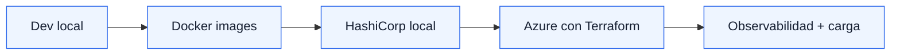
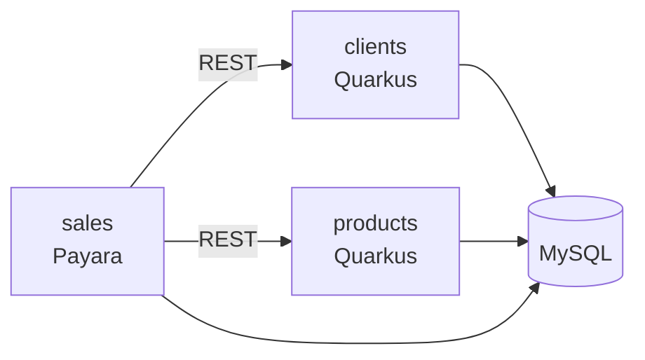
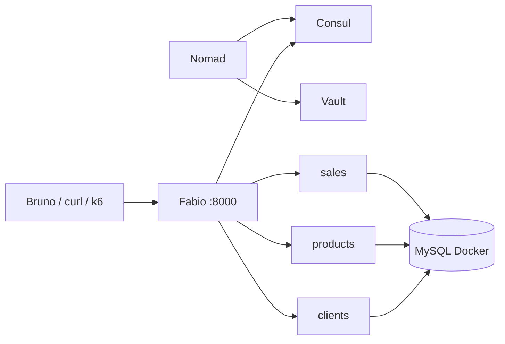
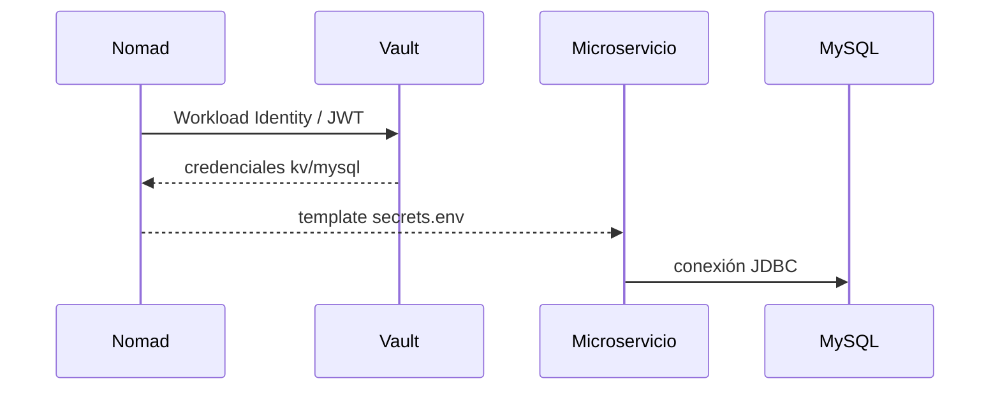
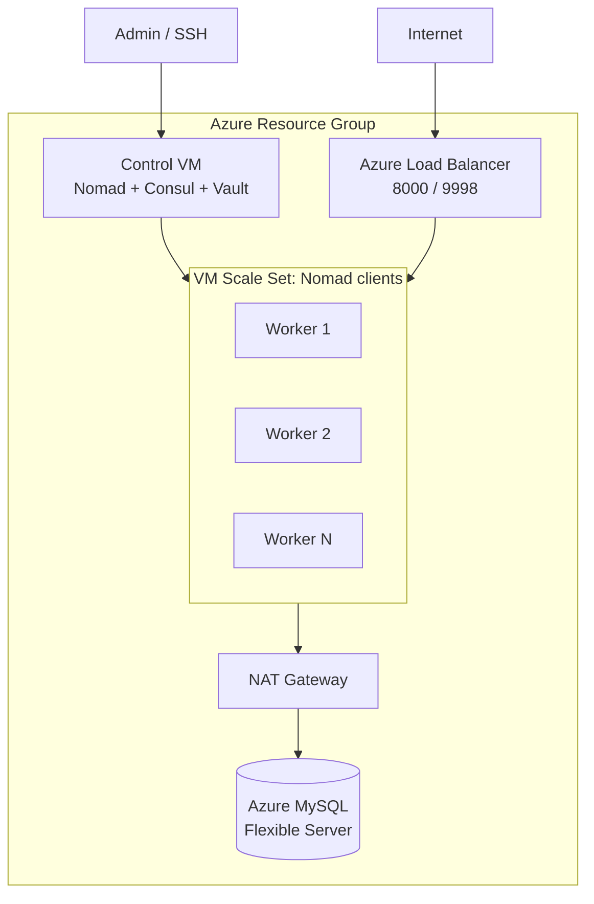

# Jakarta EE y Quarkus en Azure<br/>con HashiCorp Nomad

<div class="subclaim">
Una arquitectura portable para microservicios Java: del localhost a Docker, de Docker a Nomad, y de Nomad a Azure.
</div>

<div class="mt-10 flex gap-2">
  <span class="pill">Jakarta EE</span>
  <span class="pill">Quarkus</span>
  <span class="pill">Nomad</span>
  <span class="pill">Consul</span>
  <span class="pill">Vault</span>
  <span class="pill">Azure</span>
</div>

<!--
Abrir con el problema: no todos los proyectos pequenos/medianos necesitan arrancar directamente con Kubernetes.
-->

---
layout: center
---

<div class="claim">
La pregunta no es si AKS sirve.<br/><br/>
La pregunta es si todos los proyectos necesitan AKS desde el día uno.
</div>

<div class="subclaim">
Para equipos pequeños y medianos, la plataforma también debe ser fácil de operar, explicar, repetir y pagar.
</div>

---

# El problema

<div class="grid grid-cols-2 gap-8 mt-8">

<div>

### Lo que queremos

- Microservicios Java desplegables.
- Service discovery.
- Secrets fuera del código.
- Gateway dinámico.
- Health checks.
- Escalado horizontal.
- Infra reproducible.

</div>

<div>

### Lo que queremos evitar

- Operación innecesariamente compleja.
- Plataforma sobredimensionada.
- Costos difíciles de explicar.
- Demos que dependen de pasos manuales.
- Acoplar la app al orquestador.

</div>

</div>

---

# La propuesta



<div class="callout mt-8">
La demo muestra una evolución incremental: primero las aplicaciones, luego los contenedores, después la plataforma local, y finalmente el despliegue cloud.
</div>

---

# Aplicaciones

| Servicio              | Tecnologia                | Responsabilidad                         |
|-----------------------|---------------------------|-----------------------------------------|
| `clients-hc-example`  | Quarkus JVM               | API de clientes                         |
| `products-hc-example` | Quarkus JVM               | API de productos                        |
| `sales-hc-example`    | Jakarta EE / Payara Micro | API de ventas; consume clients/products |

<div class="mt-8">



</div>

---

# Ambiente 1: localhost

<div class="grid grid-cols-2 gap-8">

<div>

### Objetivo

Mostrar que son aplicaciones Java normales.

- Quarkus corre en modo dev.
- Payara empaqueta y despliega WAR.
- El dominio no depende de Nomad.

</div>

<div>

```bash
cd clients-hc-example
./mvnw quarkus:dev

cd products-hc-example
./mvnw quarkus:dev

cd sales-hc-example
./mvnw package -Pdev
```

</div>

</div>

---

# Ambiente 2: Docker

<div class="claim">
El salto importante: convertir cada servicio en workload portable.
</div>

```bash
mvn clean install -Pprod
```

<div class="mt-8">

| Imagen                                        | Runtime      |
|-----------------------------------------------|--------------|
| `apuntesdejava/clients-hc-example-jvm:0.0.1`  | Quarkus JVM  |
| `apuntesdejava/products-hc-example-jvm:0.0.1` | Quarkus JVM  |
| `apuntesdejava/sales-hc-example:0.0.1`        | Payara Micro |

</div>

---

# Ambiente 3: HashiCorp local



<div class="mt-6 grid grid-cols-4 gap-4">
<div class="metric"><div class="value">Nomad</div><div class="label">scheduler</div></div>
<div class="metric"><div class="value">Consul</div><div class="label">discovery</div></div>
<div class="metric"><div class="value">Vault</div><div class="label">secrets</div></div>
<div class="metric"><div class="value">Fabio</div><div class="label">gateway</div></div>
</div>

---

# Enrutamiento sin configurar rutas a mano

Los jobs registran servicios en Consul con tags:

```hcl
tags = ["urlprefix-/products"]
```

Fabio lee Consul y enruta automáticamente:

| Ruta publica       | Servicio           |
|--------------------|--------------------|
| `/clients/api`     | `clients-backend`  |
| `/products/api`    | `products-backend` |
| `/sales/resources` | `sales-backend`    |

<div class="callout mt-6">
Los puertos internos son dinamicos. La URL pública no cambia cuando se escala.
</div>

---

# Secrets con Vault



<div class="callout mt-6">
Las credenciales no viven en el código ni en la imagen Docker. Nomad las inyecta en tiempo de ejecución.
</div>

---

# Ambiente 4: Azure



---

# Terraform: infraestructura reproducible

```bash
cd infra/terraform
terraform init
terraform validate
terraform apply
```

Outputs esperados:

```text
control_public_ip
gateway_public_ip
fabio_ui
mysql_host
ssh_control
```
 
---

# Seed de datos controlado

```bash
bash ./infra/scripts/seed-azure-db.sh --reset
```

El script:

- Lee outputs de Terraform.
- Entra por SSH a la VM de control.
- Ejecuta `mysql:9.7` como contenedor temporal.
- Carga `infra/mysql/init/init.sql`.
- Evita duplicar datos si ya existen tablas.
 
---

# Demo en vivo: orden sugerido

1. Mostrar `terraform apply`.
2. Mostrar outputs.
3. Abrir Nomad UI.
4. Abrir Consul UI.
5. Abrir Fabio UI.
6. Probar endpoints por gateway.
7. Ejecutar carga con k6.
8. Escalar `products` y `clients`.
9. Mostrar que la URL pública no cambia.

---

# Carga con k6

```bash
BASE_URL=http://<gateway_public_ip>:8000 \
PEAK_VUS=120 \
SALE_RATIO=0.05 \
K6_WEB_DASHBOARD=true \
K6_WEB_DASHBOARD_EXPORT=load-tests/k6/report-azure.html \
k6 run load-tests/k6/live-demo.js
```

Dashboard:

```text
http://127.0.0.1:5665
```
 

---

# Ver el latido de la plataforma

```bash
bash ./infra/scripts/watch-azure-live.sh
```

Muestra:

- Nodos Nomad.
- Jobs Nomad.
- Servicios y checks Consul.
- Probes del gateway.
- Estado de Fabio UI.

<div class="callout mt-6">
Mientras k6 genera presión, Nomad/Consul/Fabio muestran si la plataforma sigue estable.
</div>

---

# Escalado manual

```bash
ssh azureuser@<control_public_ip>

nomad job scale products-backend api 3
nomad job scale clients-backend api 3
```

Verificación:

```bash
nomad job status products-backend
consul catalog services
```

<div class="claim mt-8">
Más instancias, misma URL pública.
</div>

---

# Comparativa: AKS vs HashiCorp

<div class="compare">

| Tema          | AKS                            | Nomad + Consul + Vault      |
|---------------|--------------------------------|-----------------------------|
| Control plane | Gestionado por Azure           | VM propia                   |
| Orquestación  | Kubernetes                     | Nomad                       |
| Discovery     | Services/CoreDNS               | Consul                      |
| Secrets       | K8s Secrets / Key Vault / CSI  | Vault                       |
| Gateway       | Ingress / App Gateway          | Fabio + Azure LB            |
| Operación     | Más ecosistema, más superficie | Menos piezas, menor curva   |
| Mejor para    | Plataformas grandes            | Proyectos pequenos/medianos |

</div>

---

# Costos: lectura honesta

Suposición aproximada:

| Escenario    |                        Fórmula | Orden mensual |
|--------------|-------------------------------:|--------------:|
| Nomad demo   |          1 control + 3 workers |        ~4 VMs |
| AKS Free     | 3 workers + control plane free |        ~3 VMs |
| AKS Standard | 3 workers + control plane pago |  ~3 VMs + fee |
| Nomad HA     |          3 control + 3 workers |        ~6 VMs |

<div class="callout mt-6">
Contra AKS Standard, Nomad con 1 control VM puede ser competitivo. Contra AKS Free, AKS suele ganar en costo puro. Con Nomad HA, AKS Standard puede ser más eficiente.
</div>

---

# Entonces, cuando elegir cada uno

<div class="grid grid-cols-2 gap-8">

<div>

### Nomad tiene sentido si

- Equipo pequeño/mediano.
- Workloads Docker simples.
- Necesitas discovery/secrets/gateway.
- Quieres menor complejidad operativa.
- La plataforma debe explicarse rápido.

</div>

<div>

### AKS tiene sentido si

- Ya necesitas ecosistema Kubernetes.
- Requieres HPA/KEDA/CRDs/operators.
- Muchos equipos comparten plataforma.
- Necesitas estándar cloud-native amplio.
- Requieres control plane gestionado robusto.

</div>

</div>

---
layout: center
---

<div class="claim">
La propuesta no es reemplazar AKS siempre.<br/>
Es evitar pagar complejidad antes de necesitarla.
</div>

<div class="subclaim">
Para ciertos proyectos Java pequeños y medianos, Nomad + Consul + Vault puede ser suficiente, portable y más fácil de operar.
</div>

---

# Cierre

Lo demostrado:

- Mismas apps desde local hasta Azure.
- Docker como unidad portable.
- Nomad agenda workloads.
- Consul descubre servicios.
- Vault entrega secretos.
- Fabio enruta dinámicamente.
- Terraform reproduce la infraestructura.
- k6 valida carga en vivo.

<div class="claim mt-8">
Una plataforma pequeña, entendible y demostrable.
</div>

---

# Referencias

- Repo: `github.com/apuntesdejava/jakartaee-nomad-arch`
- AKS pricing tiers: `learn.microsoft.com/azure/aks/free-standard-pricing-tiers`
- Azure Retail Prices API: `learn.microsoft.com/rest/api/cost-management/retail-prices`
- Nomad: `developer.hashicorp.com/nomad`
- Consul: `developer.hashicorp.com/consul`
- Vault: `developer.hashicorp.com/vault`
- k6 Web Dashboard: `grafana.com/docs/k6/latest/results-output/web-dashboard/`

